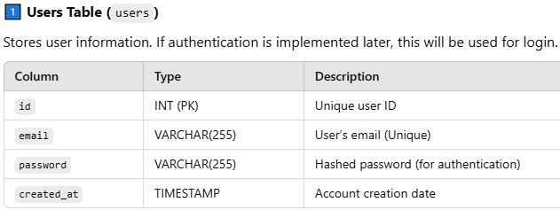
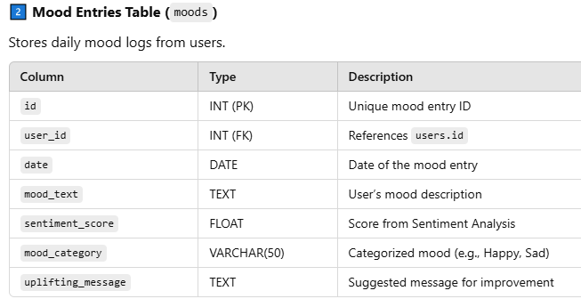
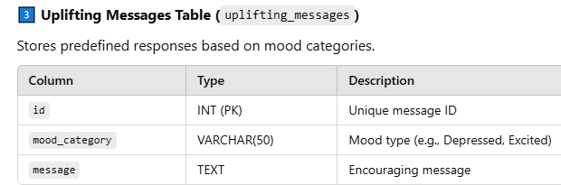
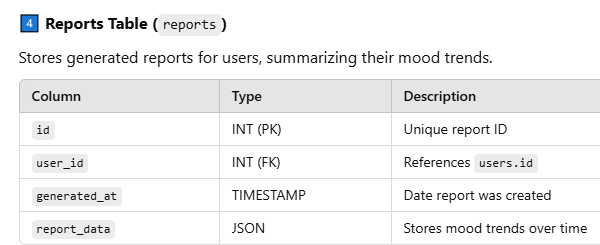

## VibesRadar

### Overview

- VibesRadar is a mood journal app that helps users track their moods/feelings and provides uplifting messages to improve their state of mind. It also offers mood tracking over time, which can be useful for personal reflection or for therapists monitoring their patients' progress.

### Problem Space

- **Primary Users:**
    - Struggle to communicate their feelings effectively.
    - Lack tools to track their moods over time.
    - Need actionable tips to improve their emotional state.
- **Therapists:**
    - Require a secure platform to monitor patients' moods.
    - Need insights into mood trends for better therapy outcomes.

### User Profile

- **Features:**
  - As a user, I want to be able to create an account so that I can access all the cool features of VibesRadar.
  - As a user, I want to be able to log in using my already created credentials, so that I can access the application.
  - As a user, I want to be able to log my daily mood.
  - As a user, I want to receive a tip when I submit my mood daily.
  - As a user, I want to be able to go back and edit my profile.
  - As a user, I want to view a report of my entries over time.
  - As a user, I want to be able to download the report of mood summary over time.

## Implementation

### Tech Stack

- **Frontend:** React, JavaScript, Bootstrap
- **Backend:** Node.js, Express, MySQL
- **APIs:** Hugging Face API for sentiment analysis

#### Libraries

- **Frontend:**
  - `react-router` for routing
  - `axios` for API calls
  - `react-chartjs-2` for data visualization
- **Backend:**
  - `knex` for database queries
  - `bcrypt` for password hashing
  - `jsonwebtoken` for authentication

#### Pages

- **Login:** User login page with credentials form.
- **Home:** User's dashboard showing form for creating vibes.
- **Report:** A page displaying past mood entries and summary of the user's mood trends as well as download option.
- **Profile:** Edit and view profile information.
- **History:** View previous mood logs and associated tips.

### Data

- **Users Table:** Stores user information (e.g., username, email, password).
- **Mood Table:** Stores mood entries (e.g., mood category, mood text, date).
- **Uplifting Messages Table:** Stores uplifting messages for each mood category.
- **Reports Table:** Stores mood trend data for each user.









### Endpoints

#### Authentication

- **POST /register:** Register a new user.
  - Request Body:

    ```json
    {
      "username": "john_doe",
      "email": "john@example.com",
      "password": "password123"
    }
    ```

  - Response:

    ```json
    {
      "message": "User registered successfully!",
      "user_id": 1
    }
    ```

- **GET /login:** Log in an existing user.
  - Request Body:

    ```json
    {
      "email": "john@example.com",
      "password": "password123"
    }
    ```

  - Response:

    ```json
    {
      "message": "Login successful!",
      "token": "jwt_token_here"
    }
    ```

- **GET /history:** Retrieves all the latest mood entry and uplifting message for the logged-in user.
  - Response:

    ```json
    {
      "username": "john_doe",
      "mood_category": "Happy",
      "upliftingMessage": "Keep shining! You're doing amazing!"
    }
    ```

- **POST /mood:** Saves the user's mood entry and returns an uplifting message.
  - Request Body:

    ```json
    {
      "mood": "Sad",
      "mood_text": "Feeling down today."
    }
    ```

  - Response:

    ```json
    {
      "message": "Mood logged successfully!",
      "mood": "Sad",
      "upliftingMessage": "You're not alone. Take a deep breath and take one step at a time."
    }
    ```

- **GET /report:** Fetches all past mood entries for the logged-in user.
  - Response:

    ```json
    {
      "user": "john_doe",
      "moodHistory": [
        {
          "date": "2025-03-01",
          "mood": "Happy",
          "mood_text": "Had a great day!"
        },
        {
          "date": "2025-03-02",
          "mood": "Sad",
          "mood_text": "Feeling down today."
        }
      ]
    }
    ```

## Roadmap

### Backend Setup (Day 1-2)
- Initialize **Node.js & Express**
- Set up **database schema** (users, mood entries)
- Create **mood logging API** (`POST /mood`)

### Frontend Setup
- Initialize **React App**
- Set up **React Router** (Register, Login, Home, Reports)
- Build **basic Home Page UI**

---

### Backend: Implement Reports Functionality (Day 3-5)
- Create **GET `/report`** to fetch past mood entries and also download report.
- **Update `POST /mood`** to allow users to select a **specific date** instead of only logging today's date.

### Frontend: Build the Reports Page & Calendar Feature
- Display **past mood entries** in a table/list.
- Add **calendar component** where users can **select a date** and log their mood for that day.
- Implement a **Download Report** button.

**Test Calendar Functionality**
- Ensure moods are being **logged for the correct date**.

---

### Backend: Integrate Sentiment Analysis (Day 5-8)
- Use `Hugging Face Transformer for sentiment classification`.
- Modify **`POST /mood`** to analyze mood text and categorize sentiment.
- Store sentiment score in the database.
- Show **mood category** (Happy, Sad, Frustrated, etc.).
- Display **uplifting message based on mood**.

---

### Improve Overall UI/UX (Day 9)
- Enhance **Home & Reports page design**.
- Make calendar & mood logging more **user-friendly**.

**Test Core Functionality**
- Ensure users can **log moods & view history**.
- Fix any **bugs in sentiment analysis**.

---

**Test all features**

---

### Future Implementations 🌱

- Ability to have tags such as "work", "relationship", and allow users to track which of these affects their vibes most.
- Forgot password functionality  in the Login Page.
- Additional Page for psychologists to register and view reports of their patients.
- Embed Google calendars to remind users to log their mood journal for the day.
- Add a streak-based rewarding functionality.
- Add functionality to analyze vibes from live camera or photo uploads.
- Allow users to use emojis or text to describe how they are feeling.
- Add emojis to the uplifting messages retrieved from the database.
- AI Recommendations - Use advanced models for mood suggestions.
