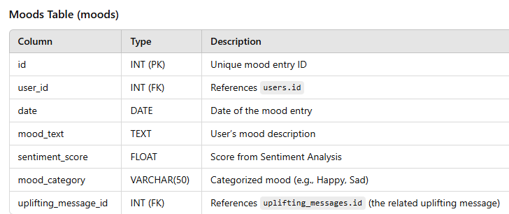

# Project Title

## VibesRadar

## Overview

What is your app? Give a brief description in a couple of sentences.

- VibesRadar is a mood journal app that helps users track their moods/feelings and provides uplifting messages to improve their state of mind. It also offers mood tracking over time, which can be useful for personal reflection or for therapists monitoring their patients' progress.

### Problem Space

Why is your app needed? Give any background information around any pain points or other reasons.

- Primary Users;
  - Want to communicate their feelings.
  - Want to track their moods over time.
  - Seek tips to improve their emotional state.
- Therapists:
  - Need a safe space to track their patients' moods.
  - Want to analyze mood trends for better therapy outcomes.

### User Profile

Who will use your app? How will they use it? Add any special considerations that your app must take into account.

### Users who are

- looking for a ways to commuincate their feeling
- looking to keep their feelings in check by tracking it
- Get tips on how to feel better
- Therapists looking for a safe space to track their patients feelings

### Features

List the functionality that your app will include. These can be written as user stories or descriptions with related details. Do not describe _how_ these features are implemented, only _what_ needs to be implemented.

- As a user, I want to be able to create an account so that I can access all the cool fetaures of VibesRadar.
- As a user, I want to be able to log in using my already created credentials, so that I can access the application.
- As a user, I want to be able to log my daily mood
- As a user, I want to receive a tip when I submit my mood daily
- As a user, I wnat to be able to go back and edit my entry.
- As a user I want to be able to delete my entry
- As a user, I want to view a report of my entry over time
- As a user, I want to be able to download the report of mood summary over time.

## Implementation

### Tech Stack

List technologies that will be used in your app, including any libraries to save time or provide more functionality. Be sure to research any potential limitations.

- React
- JavaScript
- MySQL
- Nodejs
- Client libraries:
  - react
  - react-router
  - axios
  - Email-Validator
  - npm sentiment or TensorFlow
- Server libraries:
  - knex
  - express
  - bcrypt for password hashing

### APIs

List any external sources of data that will be used in your app.

### Sitemap

List the pages of your app with brief descriptions. You can show this visually, or write it out.

- Register
- Login
- Home Page
- Report Page

### Mockups

Provide visuals of your app's screens. You can use pictures of hand-drawn sketches, or wireframing tools like Figma.

!

### Data

Describe your data and the relationships between the data points. You can show this visually using diagrams, or write it out.

### Endpoints

List endpoints that your server will implement, including HTTP methods, parameters, and example responses.

Authentication:

- POST /register: Register a new user.

  - Request body {

    "username": "john_doe",

    "email": "<john@example.com>",

    "password": "securepassword"

}

- Response body {

  "message": "User registered successfully!",

  "user_id": 1

  }

- POST /login: Log in an existing user.
- - Request body {

  "email": "<john@example.com>",

  "password": "securepassword"

}

- - Response {

  "message": "Login successful!",

  "token": "jwt_token_here"

}

- GET /home – Retrieves the latest mood entry and uplifting message for the logged-in user.

{

"username": "john_doe",

"latest_mood": "Happy",

"upliftingMessage": "Keep shining! You're doing amazing!"

}

- POST /mood – Saves the user's mood entry and returns an uplifting message.
- - Request body {

  "notes": "Feeling very stressed and tired today."

}

Response {

"message": "Mood logged successfully!",

"mood": "Sad",

"upliftingMessage": "You're not alone. Take a deep breath and take one step at a time."

}

- GET /report Fetches all past mood entries for the logged-in user.
- - {

  "user": "john_doe",

  "moodHistory": [

  {

      "date": "2025-03-01",

      "mood": "Happy",

      "notes": "Had a great day!"

  },

  {

      "date": "2025-03-02",

      "mood": "Sad",

      "notes": "Feeling down today."

  }

  ]

}

- GET /report/download – Generates and downloads a mood report (CSV or PDF).
- Response {

  "message": "Your mood report has been downloaded successfully!"

}

## Roadmap

Scope your project as a sprint. Break down the tasks that will need to be completed and map out timeframes for implementation working back from the capstone due date.

**Backend Setup**

Day 1-2

- Initialize **Node.js & Express**
- Set up **database schema** (users, mood entries)
- Create **mood logging API** (`POST /mood`)

  **Frontend Setup**

- Initialize **React App**
- Set up **React Router** (Register, Login, Home, Reports)
- Build **basic Home Page UI**

---

**Backend: Implement reports functionality**

Day 3-5

- Create **GET `/report`** to fetch past mood entries
- Create **GET `/report/download`** to allow report download
- **Update `POST /mood`** to allow users to select a **specific date** instead of only logging today's date

  **Frontend: Build the Reports Page & Calendar Feature**

- Display **past mood entries** in a table/list
- Add **calendar component** where users can **select a date** and log their mood for that day
- Implement a **Download Report** button

  **Test calendar functionality**

- Ensure moods are being **logged for the correct date**

---

**Backend: Integrate Sentiment Analysis**

Day 5-8

- Install **`sentiment` npm package**
- Modify **`POST /mood`** to analyze mood text and categorize sentiment
- Store sentiment score in the database
- Show **mood category** (Happy, Sad, Frustrated, etc.)
- Display **uplifting message based on mood**

---

**Improve Overall UI/UX**

Day 9nt

- Enhance **Home & Reports page design**
- Make calendar & mood logging more **user-friendly**

  **Test Core Functionality**

- Ensure users can **log moods & view history**
- Fix any **bugs in sentiment analysis**

---

Test **all features**

- Deploy backend & frontend

---

Your project will be marked based on what you committed to in the above document. Here, you can list any additional features you may complete after the MVP of your application is built, or if you have extra time before the Capstone due date.

- Ability to have tags such as work , relationship and have user chooser between any or all of this in order to track down which of these affects their moods heavily.
- Forgot password functionality
- Additional Page for psychologists to register and view reports of their patients.
- Embed google calendars to remind users to log their mood journal for the day.
- Deploy as a mobile App
- Add Google OAuth Login
- Implement Dark mode
- Profile Page - Allow users to customize their experience
- AI Recommendations - Use advanced models for mood suggestion
  - Create **Register (`POST /register`) & Login (`POST /login`)**
  - Secure endpoints with **JWT authentication**
  - Create **Register & Login Forms**
  - Protect pages using **React Router & Auth Context**
